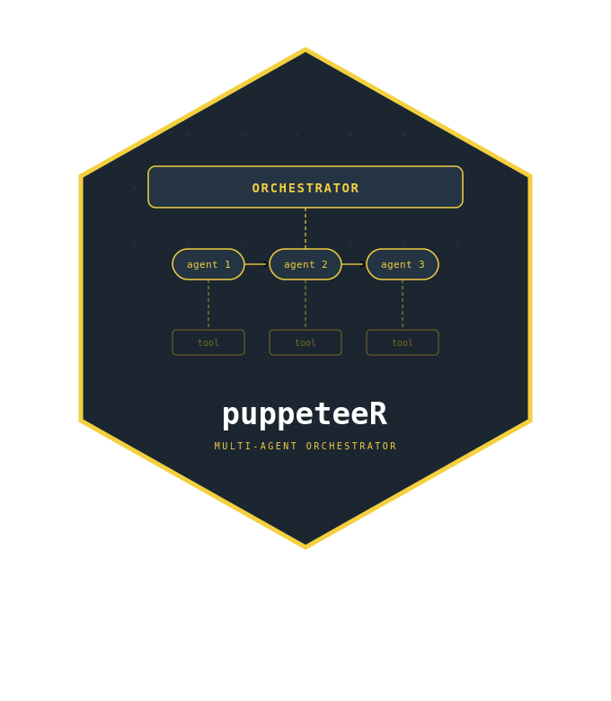

# puppeteeR 

<!-- badges: start -->
[](https://lifecycle.r-lib.org/articles/stages.html#experimental)
[](https://github.com/Arnold-Kakas/puppeteeR/actions/workflows/R-CMD-check.yaml)
<!-- badges: end -->

**puppeteeR** orchestrates multiple LLM agents into coordinated workflows. Define agents with different roles, providers, and tools - then wire them into a graph where each agent acts on shared state, routes work conditionally, and hands off to the next.

Built on [ellmer](https://ellmer.tidyverse.org/) for LLM access. Inspired by [LangGraph](https://github.com/langchain-ai/langgraph) but designed to feel like idiomatic R.

> **Note:** This package is not related to Google's puppeteeR browser automation library for Node.js. The name refers to orchestrating agents like a puppeteeR controlling characters on a stage.

## Installation

```r
# install.packages("pak")
pak::pak("Arnold-Kakas/puppeteeR")
```

## Quick start

### Sequential pipeline - code review

Three agents pass work along a chain: coder writes, reviewer critiques, writer summarizes.

```r
library(puppeteeR)
library(ellmer)

coder <- agent(
  name = "coder",
  chat = ellmer::chat_anthropic(),
  role = "Expert R programmer",
  instructions = "Write clean, idiomatic R code. Return ONLY code blocks."
)

reviewer <- agent(
  name = "reviewer",
  chat = ellmer::chat_anthropic(),
  role = "Senior code reviewer",
  instructions = "Review R code for bugs, style, and performance. Be specific."
)

writer <- agent(
  name = "writer",
  chat = ellmer::chat_anthropic(),
  role = "Technical writer",
  instructions = "Summarize the code and review for a non-technical audience."
)

pipeline <- sequential_workflow(list(
  coder    = coder,
  reviewer = reviewer,
  writer   = writer
))

result <- pipeline$invoke(list(
  messages = list("Write an R function to detect outliers using the IQR method")
))
```

### Custom graph - email triage with routing

Build a graph where a classifier routes emails to different handlers, with a human approval step.

```r
schema <- workflow_state(
  messages = list(default = list(), reducer = reducer_append()),
  classification = list(default = NULL),
  draft = list(default = NULL),
  approved = list(default = FALSE)
)

classifier <- agent("classifier", ellmer::chat_anthropic(),
  instructions = "Classify the email as 'urgent', 'routine', or 'spam'. Return ONLY the label.")

drafter <- agent("drafter", ellmer::chat_anthropic(),
  instructions = "Draft a professional reply to this email.")

graph <- state_graph(schema) |>
  add_node("classify", function(state, config) {
    msgs  <- state$get("messages")
    email <- as.character(msgs[[length(msgs)]])
    result <- config$agents$classifier$chat(email)
    list(classification = trimws(tolower(result)))
  }) |>
  add_node("draft_reply", function(state, config) {
    msgs  <- state$get("messages")
    email <- as.character(msgs[[length(msgs)]])
    prompt <- sprintf("Classification: %s\n\nEmail: %s\n\nDraft a reply.",
                      state$get("classification"), email)
    list(draft = config$agents$drafter$chat(prompt))
  }) |>
  add_node("human_review", function(state, config) {
    cat("Draft:\n", state$get("draft"), "\n")
    list(approved = readline("Approve? (y/n): ") == "y")
  }) |>
  add_edge(START, "classify") |>
  add_conditional_edge("classify",
    routing_fn = function(state) state$get("classification"),
    route_map = list(urgent = "draft_reply", routine = "draft_reply", spam = END)
  ) |>
  add_edge("draft_reply", "human_review") |>
  add_conditional_edge("human_review",
    routing_fn = function(state) if (isTRUE(state$get("approved"))) "done" else "revise",
    route_map = list(done = END, revise = "draft_reply")
  )

runner <- graph$compile(
  agents = list(classifier = classifier, drafter = drafter),
  checkpointer = memory_checkpointer()
)

result <- runner$invoke(
  list(messages = list("Our production server is down, we need help ASAP")),
  config = list(thread_id = "email_42", max_iterations = 10)
)
```

### Supervisor - dynamic task routing

A manager agent decides which specialist handles each sub-task.

```r
manager <- agent("manager", ellmer::chat_anthropic(),
  instructions = "Route tasks to specialists: 'analyst', 'coder', or 'writer'.
    Respond with ONLY the specialist name, or 'DONE' when complete.")

team <- supervisor_workflow(
  manager = manager,
  workers = list(
    analyst = agent("analyst", ellmer::chat_anthropic(), role = "Data analyst"),
    coder = agent("coder", ellmer::chat_anthropic(), role = "R programmer"),
    writer = agent("writer", ellmer::chat_anthropic(), role = "Report writer")
  ),
  max_rounds = 8
)

result <- team$invoke(list(
  messages = list("Analyze the mtcars dataset and write a brief report")
))
```

## Visualization

Visualize workflow structure before running:

```r
# Static DOT diagram
graph$visualize()

# Interactive (opens in viewer or browser)
graph$visualize(engine = "visnetwork")

# Export to PNG/SVG
graph$export_diagram("workflow.svg")
```

Monitor a running workflow:

```r
# Stream execution and watch state changes
gen <- runner$stream(list(messages = list("Our production server is down, we need help ASAP")))
coro::loop(for (step in gen) {
  cat(sprintf("[step %d] node: %s\n", step$iteration, step$node))
})

# Cost report after execution
runner$cost_report()
# # A tibble: 4 × 5
#   agent      provider   input output   cost
#   <chr>      <chr>      <int>  <int>  <dbl>
# 1 classifier openai       340     12  0.001
# 2 drafter    anthropic    890    445  0.012
# ...
```

## Key concepts

| Concept | What it is |
|---|---|
| **Agent** | An LLM identity: wraps an ellmer Chat with a name, role, instructions, and tools |
| **WorkflowState** | Shared mutable state with typed channels and reducer functions |
| **StateGraph** | A directed graph of nodes (functions) connected by edges (fixed or conditional) |
| **GraphRunner** | A compiled, executable graph. Call `$invoke()` to run, `$stream()` to watch |
| **Checkpointer** | Saves state at each step for resume-after-failure and human-in-the-loop |
| **TerminationCondition** | Composable stop rules: `max_turns(20) | cost_limit(5.00)` |

## Workflow patterns

- **Sequential**: Agents in a chain. Use `sequential_workflow()`.
- **Supervisor**: A manager routes to specialists dynamically. Use `supervisor_workflow()`.
- **Debate**: Agents take turns arguing, a judge decides. Use `debate_workflow()`.
- **Custom graph**: Build any DAG (or cyclic graph) with `state_graph()`.

## Related packages

- [ellmer](https://ellmer.tidyverse.org/) - the LLM engine under the hood
- [LangGraph](https://github.com/langchain-ai/langgraph) (Python) - architectural inspiration
- [mini007](https://cran.r-project.org/package=mini007) - simpler multi-agent framework for R
- [LLMAgentR](https://github.com/knowusuboaky/LLMAgentR) - single-agent graph workflows

## License

MIT
